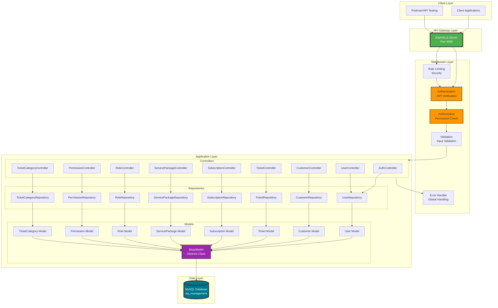
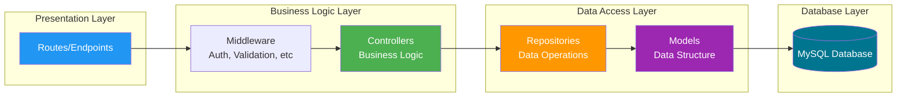
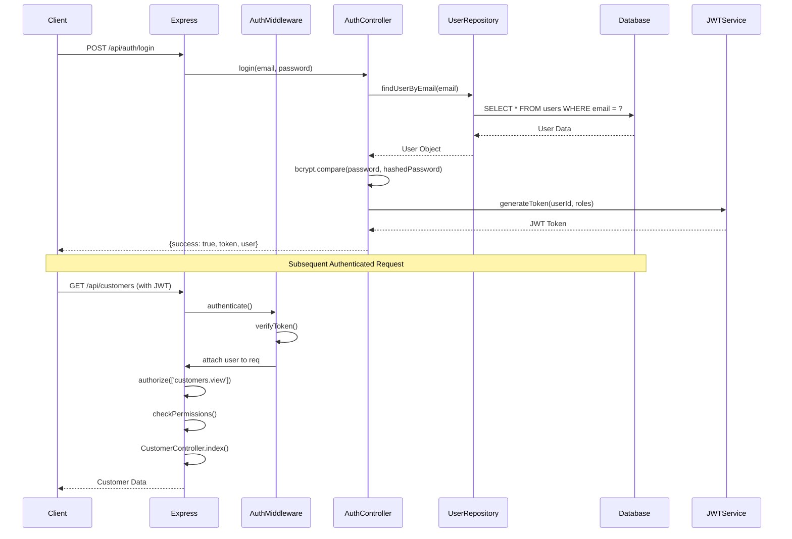
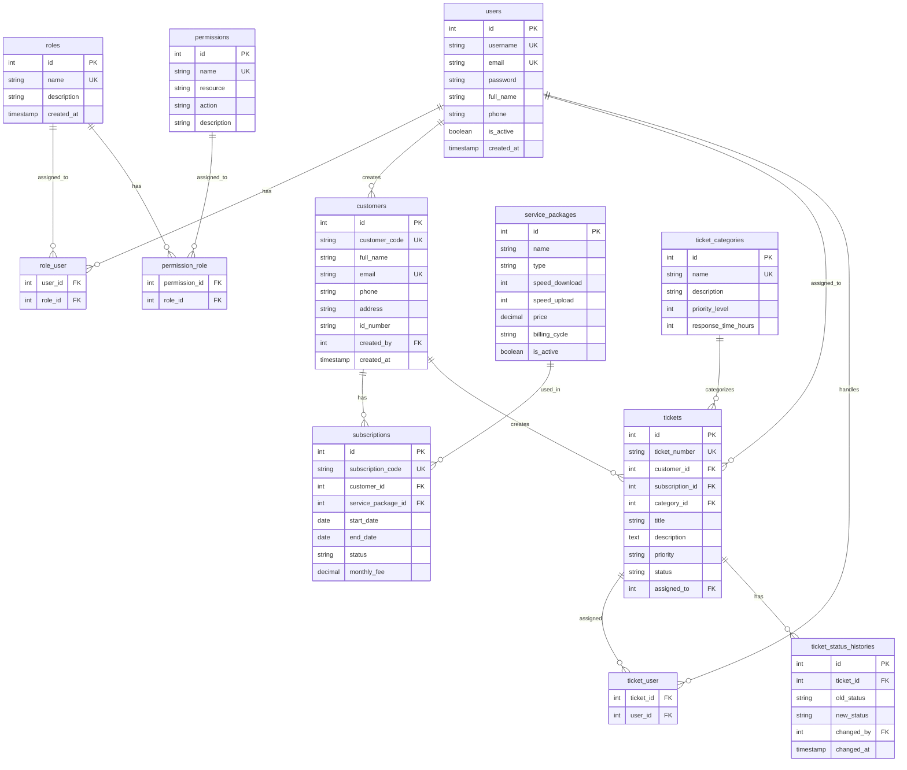
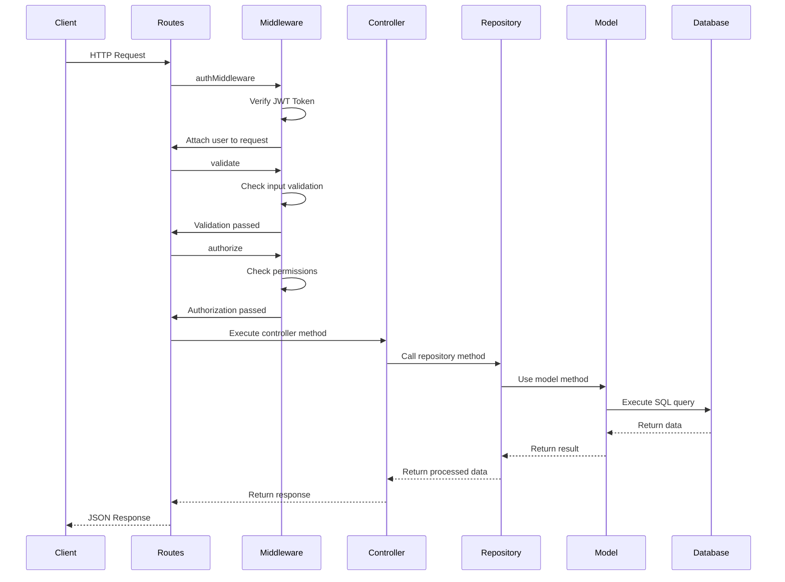
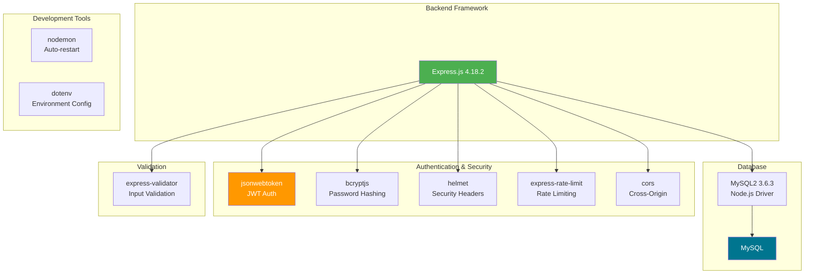
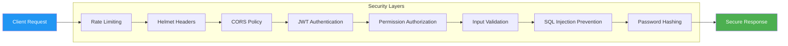
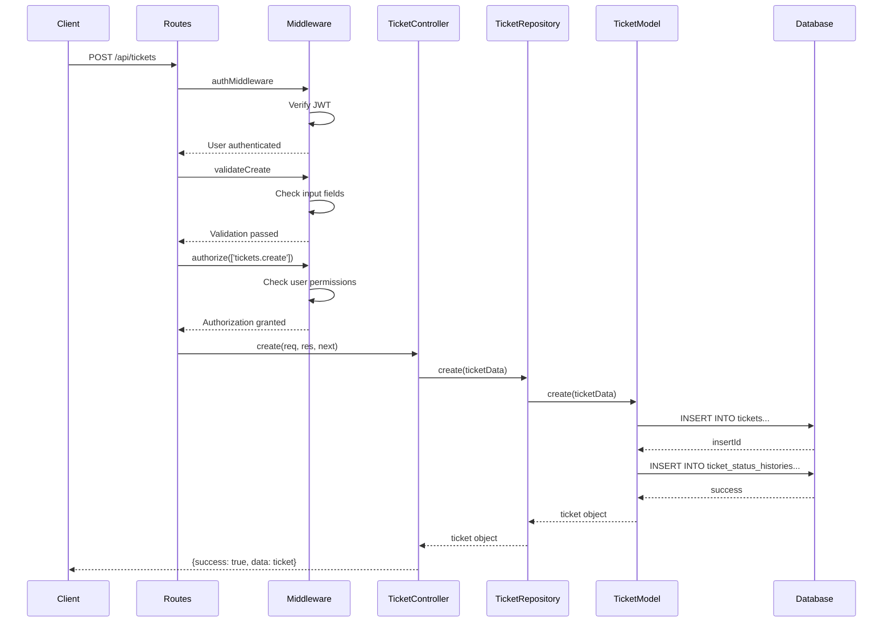

# ISP Management System - Architecture Documentation

## 📐 System Architecture Overview



## 🏗️ Layered Architecture



## 🔐 Authentication & Authorization Flow



## 📊 Database Schema Relationships



## 🔄 Request/Response Flow



## 📁 Directory Structure

```
ISP Management System
│
├── src/
│   ├── app.js                      # Application entry point
│   ├── config/
│   │   └── database.js            # MySQL connection configuration
│   │
│   ├── middleware/
│   │   ├── auth.js                # JWT authentication middleware
│   │   ├── authorize.js           # Permission-based authorization
│   │   ├── validate.js            # Input validation middleware
│   │   ├── validation.js          # Validation helpers
│   │   └── errorHandler.js        # Global error handler
│   │
│   ├── routes/
│   │   ├── index.js               # Main router
│   │   ├── auth.js                # Authentication routes
│   │   ├── users.js               # User management routes
│   │   ├── customers.js           # Customer routes
│   │   ├── tickets.js             # Ticket routes
│   │   ├── ticketCategories.js    # Ticket category routes
│   │   ├── subscriptions.js       # Subscription routes
│   │   ├── servicePackages.js     # Service package routes
│   │   ├── roles.js               # Role management routes
│   │   └── permissions.js         # Permission management routes
│   │
│   ├── controllers/
│   │   ├── AuthController.js
│   │   ├── UserController.js
│   │   ├── CustomerController.js
│   │   ├── TicketController.js
│   │   ├── TicketCategoryController.js
│   │   ├── SubscriptionController.js
│   │   ├── ServicePackageController.js
│   │   ├── RoleController.js
│   │   └── PermissionController.js
│   │
│   ├── repositories/
│   │   ├── BaseRepository.js      # Abstract repository
│   │   ├── UserRepository.js
│   │   ├── CustomerRepository.js
│   │   ├── TicketRepository.js
│   │   ├── TicketCategoryRepository.js
│   │   ├── SubscriptionRepository.js
│   │   ├── ServicePackageRepository.js
│   │   ├── RoleRepository.js
│   │   └── PermissionRepository.js
│   │
│   └── models/
│       ├── BaseModel.js           # Abstract model with DB operations
│       ├── User.js
│       ├── Customer.js
│       ├── Ticket.js
│       ├── TicketCategory.js
│       ├── Subscription.js
│       ├── ServicePackage.js
│       ├── Role.js
│       └── Permission.js
│
├── database/
│   ├── schema.sql                 # Database schema
│   ├── seed.js                    # Database seeder
│   └── README.md
│
├── docs/
│   └── ARCHITECTURE.md            # This file
│
├── .env                           # Environment variables
├── package.json
└── README.md
```

## 🔧 Technology Stack



## 🎯 Design Patterns Used

### 1. **Repository Pattern**
- Abstraction layer between business logic and data access
- `BaseRepository` provides common CRUD operations
- Specific repositories extend BaseRepository for custom queries

### 2. **MVC (Model-View-Controller)**
- **Model**: Data structure and database operations
- **View**: JSON responses (REST API)
- **Controller**: Business logic and request handling

### 3. **Middleware Pattern**
- Chain of responsibility for request processing
- Authentication → Authorization → Validation → Controller

### 4. **Factory Pattern**
- BaseModel factory for creating model instances
- Singleton database connection

### 5. **Dependency Injection**
- Controllers depend on repositories
- Repositories depend on models
- Models depend on database connection

## 🔒 Security Features



### Security Implementations:

1. **JWT Authentication**: Stateless token-based authentication
2. **bcryptjs**: Password hashing with salt rounds
3. **Helmet**: Security HTTP headers
4. **Rate Limiting**: Prevent brute force attacks
5. **CORS**: Cross-origin resource sharing control
6. **Input Validation**: express-validator for request validation
7. **SQL Injection Prevention**: Parameterized queries
8. **Role-Based Access Control (RBAC)**: Permission-based authorization

## 📈 Scalability Considerations

1. **Stateless Architecture**: JWT allows horizontal scaling
2. **Repository Pattern**: Easy to switch to different data sources
3. **Modular Structure**: Easy to add new modules
4. **Database Connection Pooling**: Efficient connection management
5. **Error Handling**: Centralized error handling for consistency

## 🚀 API Endpoints Summary

| Module | Endpoints | Permissions Required |
|--------|-----------|---------------------|
| **Authentication** | 4 endpoints | Public/Authenticated |
| **Users** | 9 endpoints | users.* permissions |
| **Customers** | 7 endpoints | customers.* permissions |
| **Tickets** | 11 endpoints | tickets.* permissions |
| **Ticket Categories** | 6 endpoints | ticket_categories.* permissions |
| **Subscriptions** | 12 endpoints | subscriptions.* permissions |
| **Service Packages** | 8 endpoints | service_packages.* permissions |
| **Roles** | 9 endpoints | roles.* permissions (Admin) |
| **Permissions** | 9 endpoints | permissions.* permissions (Admin) |

**Total**: 75+ API Endpoints

## 📊 Data Flow Example: Create Ticket



---

## 📝 Notes

- All timestamps are in UTC
- Database uses InnoDB engine for transaction support
- Foreign key constraints ensure referential integrity
- Soft deletes not implemented (hard deletes used)
- Pagination implemented for all list endpoints
- Search functionality available in major modules

---

**Version**: 1.0.0  
**Last Updated**: October 28, 2025  
**Author**: ISP Management System Team
